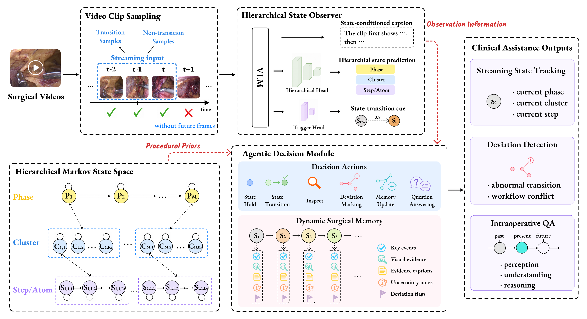

# SurgMark

**An Agentic Hierarchical Markov State-Space Framework for Streaming Surgical Video Understanding**

## Demo

📽️ **Demonstration Video**: The demo uses a cholecystectomy video as an example to show SurgMark in action, including streaming state recognition, real-time captioning, procedural memory graph construction, and interactive surgical QA.

<!-- For GitHub inline playback, replace the URL below with the GitHub user-attachments URL generated by uploading assets/videos/demo.mp4 to a GitHub issue, discussion, release note, or README editor. -->
https://github.com/sitianpan/SurgMark/raw/main/assets/videos/demo.mp4

If the video is not rendered inline by GitHub, open the repository copy directly: [assets/videos/demo.mp4](assets/videos/demo.mp4).

---

## Overview

SurgMark is a reference implementation for streaming surgical video understanding. It models surgery as a hierarchical Markov state-space process and combines a VLM-based surgical state observer, online Markov belief tracking, a dynamic procedural memory graph, and an LLM decision agent with explicit tool actions.

The framework is designed for causal intraoperative video streams. At each time step, SurgMark observes the current video window, predicts hierarchical surgical states, updates the Markov belief, commits reliable states into a procedural memory graph, and routes surgical questions to the appropriate evidence source.

Key components:

- **Hierarchical surgical state observer:** predicts multi-level surgical states and captions from streaming video windows.
- **Markov state-space tracking:** constrains noisy observations using procedure-aware transition priors and temporal guards.
- **Dynamic procedural memory graph:** stores completed states, state transitions, uncertainty, deviation notes, and graph-level procedural context.
- **Agentic decision module:** uses structured tools to hold, transition, revise, mark uncertainty/deviation, update the graph, and route QA evidence.
- **Streaming surgical QA:** answers questions about completed steps, the current operation, and expected next actions using observation, memory graph, SOP prior, or state belief.



## Data

This repository contains compact English JSONL annotations under `data/open_english/`. Raw surgical frames, private gastric data, model checkpoints, and API keys are not included.

Frame paths in the released JSONL files are relative placeholders, such as:

```text
frames/cholec/VID01/000000.png
```

Download the original public frames separately and place or symlink them under `data/frames/`.

Original public datasets:

- CholecT45: https://github.com/CAMMA-public/cholect45
- PSI-AVA / TAPIR: https://github.com/BCV-Uniandes/TAPIR
- AutoLaparo: https://github.com/ziyiwangx/AutoLaparo and https://autolaparo.github.io/

## Usage

### Environment

The reference environment used for development and experiments is:

```text
Python 3.9.21
PyTorch 2.5.1
CUDA 12.4
cuDNN 9.1
GPU: NVIDIA L40
```

Create the environment:

```bash
conda create -n surgmark python=3.9 -y
conda activate surgmark
pip install -r requirements.txt
```

Core package versions are pinned in `requirements.txt`, including:

```text
torch==2.5.1
torchvision==0.20.1
transformers==4.37.2
accelerate==0.28.0
deepspeed==0.14.4
peft==0.10.0
datasets==3.3.2
openai==2.38.0
fastapi==0.128.2
uvicorn==0.39.0
```

For full VLM training, install the dependencies required by your Intern-compatible base model. FlashAttention is optional and may require a wheel matching your CUDA, PyTorch, Python, and ABI versions.

### Prepare Labels

```bash
bash scripts/build_label_space.sh
```

### Training

Stage 1: frame-level semantic alignment.

```bash
DATASET=cholec MODEL=OpenGVLab/InternVL2-8B bash scripts/train_stage1_alignment.sh
```

Stage 2: clip-level state-aware training with hierarchical state and boundary heads.

```bash
DATASET=cholec MODEL=checkpoints/cholec_stage1_alignment bash scripts/train_stage2_state_observer.sh
```

### Testing

Run the cached observation path to test the Markov tracker, procedural memory graph, and agent interface without model weights.

```bash
bash scripts/build_label_space.sh
DRY_RUN=1 bash scripts/run_cached_stream_demo.sh
```

### Inference

Streaming inference without the LLM agent:

```bash
FRAMES_DIR=data/frames/cholec/VID01 bash scripts/run_streaming_inference.sh
```

Streaming inference with the decision agent:

```bash
export OPENAI_API_KEY=your_key_here
FRAMES_DIR=data/frames/cholec/VID01 bash scripts/run_agent_streaming.sh
```

The LLM configuration template is available at `configs/agent.example.json`. Do not commit real API keys.

## Repository Structure

```text
surgmark/                 Core Python package for SurgMark.
surgmark/data/            JSONL dataset loading and hierarchical label-space construction.
surgmark/model/           VLM observer wrapper, hierarchical state heads, and boundary heads.
surgmark/training/        Two-stage observer training entry points.
surgmark/streaming/       Online Markov tracking and streaming inference logic.
surgmark/agent/           Procedural memory graph, tools, LLM client, prompts, and decision agent.
scripts/                  Runnable scripts for label preparation, training, testing, and inference.
configs/                  Relative-path configuration templates for datasets, training, streaming, and agents.
data/open_english/        Compact English annotation files prepared for public release.
data/open_english/cholec/ CholecT45-derived state-caption and surgical-QA JSONL files.
data/open_english/psiava/ PSI-AVA-derived state-caption and surgical-QA JSONL files.
data/open_english/autolaparo/ AutoLaparo-derived state-caption and surgical-QA JSONL files.
examples/                 Small cached observation examples for running the lightweight demo path.
```

## Notes

The scripts are intentionally concise and use relative paths. They are meant to expose the core method components clearly; large-scale training may require adapting batch size, distributed launch, model wrappers, and dataset-specific preprocessing.

This repository does not include model weights, private data, raw surgical frames, or API credentials.

## Contact

For any questions or inquiries, please contact us at pansitian2025@ia.ac.cn.
