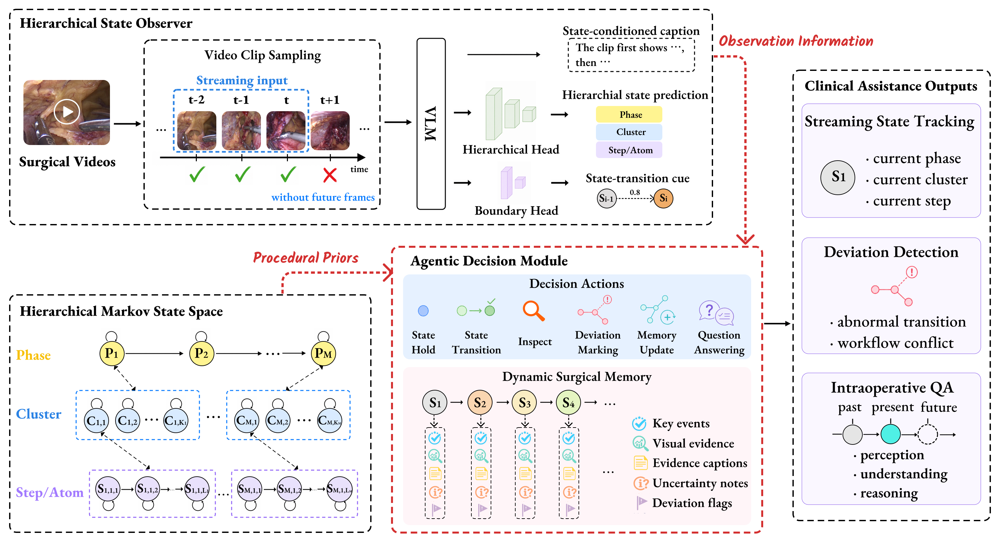

# SurgMark: Hierarchical State Tracking With Persistent Evidence Memory for Full-Length Surgical Videos
## Demo

📽️ **Demonstration Video**: The demo uses a cholecystectomy video to show causal state tracking, procedural evidence-memory construction, and anytime surgical question answering.

https://github.com/user-attachments/assets/d3f12aaf-8a6a-4cab-8e85-e3dbe8e4fa4f

If the video is not rendered inline by GitHub, open the repository copy directly: [assets/videos/demo.mp4](assets/videos/demo.mp4).

---

## Overview

SurgMark is a framework for hierarchical surgical state tracking with persistent evidence memory in full-length surgical videos. It organizes procedural states and priors within a procedure-specific hierarchical state space, extracts local visual evidence through a hierarchical state observer, and maintains temporally coherent state trajectories through Markov-guided belief tracking. Confirmed actions and their temporal and visual evidence are stored in a dynamic structured reasoning graph.

The framework processes intraoperative video causally from the beginning of a procedure. A constrained agent performs event-triggered state arbitration, memory revision, evidence retrieval, and procedure-aware tool invocation when additional reasoning is required. This supports continuous procedural tracking, historical evidence retrieval, and anytime question answering for simulated full-procedure intraoperative assistance.

Key components:

- **Hierarchical surgical state space:** represents procedure-specific states and transition and duration priors at multiple levels.
- **Hierarchical surgical state observer:** produces global and hierarchical state likelihoods, boundary evidence, and semantic descriptions from causal video windows.
- **Markov-guided belief tracking:** integrates visual evidence, procedural priors, boundary support, duration compatibility, and hierarchical consistency.
- **Persistent evidence memory:** stores confirmed events with completion status, timestamps, source frames, and multimodal evidence in a dynamic structured reasoning graph.
- **Constrained agent:** coordinates triggered state arbitration, graph-memory revision, evidence retrieval, and anytime question answering.



## Data

This repository contains compact English JSONL annotations under `data/`. Raw surgical frames, private gastric data, model checkpoints, and API keys are not included.

Frame paths in the released JSONL files are relative placeholders, such as:

```text
frames/cholec/VID01/000000.png
```

Download the original public frames separately and place or symlink them under `data/frames/`.

Original public datasets:

- CholecT45: https://github.com/CAMMA-public/cholect45
- PSI-AVA / TAPIR: https://github.com/BCV-Uniandes/TAPIR
- AutoLaparo: https://github.com/ziyiwangx/AutoLaparo and https://autolaparo.github.io/

## Usage

### Environment

Create the environment:

```bash
conda create -n surgmark python=3.9 -y
conda activate surgmark
pip install -r requirements.txt
```

Core package versions are pinned in `requirements.txt`, including:

```text
torch==2.5.1
torchvision==0.20.1
transformers==4.37.2
accelerate==0.28.0
deepspeed==0.14.4
peft==0.10.0
datasets==3.3.2
openai==2.38.0
```

For full VLM training, install the dependencies required by your Intern-compatible base model. FlashAttention is optional and may require a wheel matching your CUDA, PyTorch, Python, and ABI versions.

### Prepare Labels

```bash
bash scripts/build_label_space.sh
```

### Training

Stage 1: frame-level semantic alignment.

```bash
bash scripts/train_stage1_alignment.sh
```

Stage 2: clip-level state-aware training with hierarchical state and boundary heads.

```bash
bash scripts/train_stage2_state_observer.sh
```

### Testing

Build the hierarchical label space:

```bash
bash scripts/build_label_space.sh
```

Run streaming inference on the default prepared frame directory to inspect the online trace and procedural graph outputs:

```bash
bash scripts/run_streaming_inference.sh
```

### Inference

Streaming inference without the LLM agent:

```bash
bash scripts/run_streaming_inference.sh
```

Set your API key before running streaming inference with the decision agent:

```bash
export OPENAI_API_KEY=your_key_here
bash scripts/run_agent_streaming.sh
```

The LLM configuration template is available at `configs/agent.example.json`. Do not commit real API keys.

## Repository Structure

```text
surgmark/                 Core Python package for SurgMark.
surgmark/data/            JSONL dataset loading and hierarchical label-space construction.
surgmark/model/           VLM observer wrapper, hierarchical state heads, and boundary heads.
surgmark/training/        Two-stage observer training entry points.
surgmark/streaming/       Online Markov tracking and streaming inference logic.
surgmark/agent/           Procedural memory graph, tools, LLM client, prompts, and decision agent.
scripts/                  Runnable scripts for label preparation, training, testing, and inference.
configs/                  Relative-path configuration templates for datasets, training, streaming, and agents.
data/                     Compact English annotation files prepared for public release.
data/cholec/              CholecT45-derived state-caption and surgical-QA JSONL files.
data/psiava/              PSI-AVA-derived state-caption and surgical-QA JSONL files.
data/autolaparo/          AutoLaparo-derived state-caption and surgical-QA JSONL files.
```

## Notes

The scripts are intentionally concise and use relative paths. They are meant to expose the core method components clearly; large-scale training may require adapting batch size, distributed launch, model wrappers, and dataset-specific preprocessing.

This repository does not include model weights, private data, raw surgical frames, or API credentials.

## Contact

For any questions or inquiries, please contact us at pansitian2025@ia.ac.cn.
